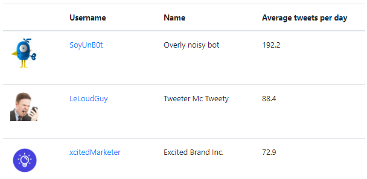

# What

Sign in with Twitter, and see _Unfollow_ Recommendations: who tweets too much and you should remove to clean up your feed (sadly
[Twitter didn't follow through with shipping this](https://www.engadget.com/2018/08/30/twitter-test-personalized-unfollow-recommendations))

The results list of who tweets the most per day on average, so you can choose who you want to unfollow 

# Disclaimer

I am a bad developer and there is a lot of bad stuff in here 😏. PLEASE feel free to submit a PR / issue. Thanks!

# Run Locally

`nodemon start`

Env variables:

* `NODE_ENV`: `production` or `development`
* `DEBUG`: e.g `lessnoise:*`
* `PORT`

# Run with Heroku

* `heroku local web`
* `git push heroku master`
* Set env variables in Heroku
    * `KEY`, `SECRET`, `SESSIONSECRET`, `USETESTDATA`

# Resources

* See [Resources.md](Resources.md) for a list of things I used and read up on for this project.

# Troubleshooting

* Make sure `PORT` is set, even locally. 
